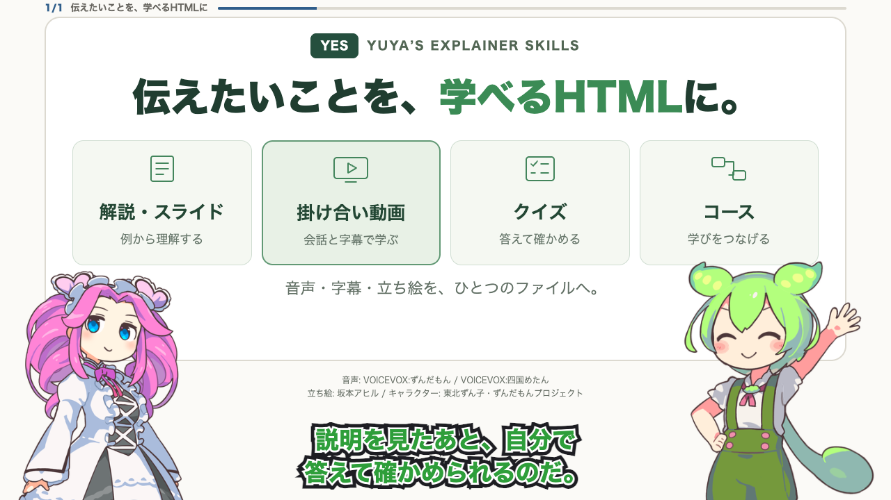

# Yuya’s Explainer Skills (YES)

| Skill | Output |
| --- | --- |
| explain | Scrollable explanation with examples and sources |
| slides | Responsive slide deck with progressive reveals |
| quiz | Multiple-choice comprehension checks with feedback |
| video | Narrated HTML player with synchronized captions |
| zundamon-video | Japanese dialogue with Zundamon and Metan |
| course | Lessons combining video, slides, and quizzes |

The default output is one self-contained HTML file. Builders can optionally
separate embedded media into an HTML + assets bundle. Publication is always a
separate task.

## See YES in action

[](../../docs/previews/yes-intro.mp4)

**[Watch or download the full introduction (MP4)](https://github.com/yuya-takeyama/agent-plugins/raw/refs/heads/main/docs/previews/yes-intro.mp4)**
— 5:13, Japanese dialogue, 1280 × 720 with audio and captions.
Made with `yes:zundamon-video`: standing characters, expressions, and lip sync
come from the actual generated HTML player. The MP4 captures the complete lesson.

[Source and reproduction steps](../../docs/examples/yes-intro/README.md).
Audio: VOICEVOX:ずんだもん / VOICEVOX:四国めたん. Artwork: 坂本アヒル.
The demo's voice and artwork retain their own
[terms](../../docs/previews/NOTICE.md); they are not covered by YES's MIT license.

## Installation

### Claude Code

```text
/plugin marketplace add yuya-takeyama/agent-plugins
/plugin install yes@yuya-plugins
```

Use `/yes:explain`, `/yes:slides`, `/yes:quiz`, `/yes:video`,
`/yes:zundamon-video`, or `/yes:course`. Plugin metadata provides the namespace;
individual skills retain short names.

### Codex

```sh
codex plugin marketplace add yuya-takeyama/agent-plugins
```

Open the plugin browser (`/plugins` in CLI, or Plugins in the desktop app),
select the `yuya-plugins` source and install `yes`. Start a new session and
select the YES skill from the skills/mention picker. Codex uses the same skill
sources and the `yes` plugin namespace.

### Other agents

Agent Plugins-compatible hosts can load `plugins/yes/plugin.json` and its
`skills/` directory. Follow the host's plugin installation instructions.
For Agent Skills-only hosts, retain the **whole plugin directory** so relative
script dependencies resolve, and configure discovery of its skills. Copying
only one skill folder is not supported. Standalone hosts may not add the `yes`
namespace; check for conflicting names. Compatibility beyond Claude Code and
Codex is format-level until listed as tested in [compatibility](../../docs/compatibility.md).

## Requirements

- Python 3.11+ and uv for builders; Node 22+ for development tests.
- Docker installed and running for speech synthesis. CPU mode works on Linux
  amd64 and arm64; macOS uses a Linux Docker VM (e.g. Docker Desktop).
- Google Chrome for screenshots, or Playwright Chromium with
  `YES_BROWSER_CHANNEL=''` after installing its browser runtime.
- First-time package/image downloads require network access. Generated single
  HTML files use system fonts and embedded media and work offline.

## Recommended places to share

We recommend **Claude Artifacts** when working in Claude, or **ChatGPT Sites**
when working in ChatGPT/Codex with Sites available. Give the agent the generated
HTML and ask it to prepare a shareable page, preserve the media and credits,
and preview it before sharing. YES creates the files; hosting is a separate step
and may need adaptation for the destination.

- **Claude Artifacts:** ask Claude to publish the single HTML as an artifact,
  then select its audience in **Share**. In Claude Code, artifacts are single
  pages with a **16 MiB rendered-page limit**; adjacent assets and relative file
  links do not work, so use YES's single-file output rather than its bundle.
  Availability and external sharing depend on your account and organization.
  See [Claude Code artifacts](https://code.claude.com/docs/en/artifacts) and
  [sharing options](https://support.claude.com/en/articles/9547008-share-artifacts).
- **ChatGPT Sites:** in Work on ChatGPT web, or Work/Codex in the desktop app,
  ask to build a website from the HTML (or mention `@Sites`). Review the preview,
  then choose the audience and publish. Public access requires **Anyone on the
  internet** to be available and selected. Sites is in public beta; availability
  and publishing permissions depend on the plan, rollout, and workspace settings.
  See [Creating and using ChatGPT Sites](https://help.openai.com/en/articles/20001339-creating-and-using-chatgpt-sites).

Checked against official documentation on **2026-10-07**. Test playback,
interactions, and access as an intended viewer after publishing. Do not assume
a sharing link is anonymous access: Anthropic's general sharing guide and Claude
Code documentation currently differ on sign-in requirements. Hosting these
examples on either service is not part of the repository's automated tests.

## Local speech command

From the repository root (or adjust the plugin path after installation):

```sh
plugins/yes/bin/yes-speak 'こんにちはなのだ。' -o narration.wav
plugins/yes/bin/yes-speak --list-speakers
plugins/yes/bin/yes-speak --list-speakers --json
plugins/yes/bin/yes-speak --text '説明するわ。' --speaker 四国めたん/ノーマル -o metan.wav
plugins/yes/bin/yes-speak --start
plugins/yes/bin/yes-speak --stop
```

The wrapper starts `voicevox/voicevox_engine:cpu-ubuntu24.04-0.25.2` using
`docker run`, bound only to a dynamically assigned localhost port. It reuses the
named `yes-voicevox-0-25-2` container across sentences and restarts it after a stop.
The container is left running for subsequent builds; `--stop` stops only this
managed container. No host directories or Docker socket are mounted into it.
The first download is large. An occupied name belonging to another container is
an error, not permission to remove that container. Existing output files require
`--force` to replace. Docker initialization can take time; `--startup-timeout`
controls the engine readiness wait after Docker starts.

`--stdin` accepts piped text. `--speed` accepts 0.5–2.0. Output is validated
24000 Hz mono 16-bit WAV. Preserve the printed VOICEVOX credit when distributing
audio and follow the selected character's terms. Each WAV is accompanied by
`<filename>.license.txt` containing its credit, terms links, and reuse conditions.
`--force` applies to both files. Keep the companion with the WAV and display the
credit in the listening context; audio-only delivery may need a spoken credit.
The command saves files and
does not automatically launch an audio player.

YES supports only **ずんだもん** and **四国めたん**, including their talk styles.
`--list-speakers` lists only these two voices with their credits and terms URL.
Other voices are rejected by name and style ID. Both supported voices share the
[SSS voice terms](https://zunko.jp/con_ongen_kiyaku.html); character and artwork
rights remain separate. See [voice and artwork conditions](THIRD_PARTY_NOTICES.md).

## Examples

```sh
uv run plugins/yes/skills/quiz/build.py build plugins/yes/skills/quiz/example/quiz.json
uv run plugins/yes/skills/video/build.py build plugins/yes/skills/video/example
uv run plugins/yes/skills/video/build.py build plugins/yes/skills/zundamon-video/example --format bundle
uv run plugins/yes/skills/video/build.py shoot plugins/yes/skills/video/example
```

Single output: `out/video.html` or `out/quiz.html`. Bundle output:
`out/video-bundle/index.html` with relative `assets/`. Serve bundles using any
static HTTP server. Do not upload just index.html without its assets.
Build intermediates, transcript, and captions remain beside the delivered file.
`--max-bytes 16777216` enforces a 16 MiB HTML limit when a destination needs it.

The video format is an HTML player, not an MP4. Progress storage is best-effort
localStorage with in-memory fallback. No Stash connection, API key, or cloud
speech account is required. `zundamon-video` uses both standing characters,
expressions, and lip sync by default; voice-only dialogue is an explicit option.
The first dialogue build downloads the character sources into a local cache.
For character artwork terms see
[third-party notices](THIRD_PARTY_NOTICES.md).
